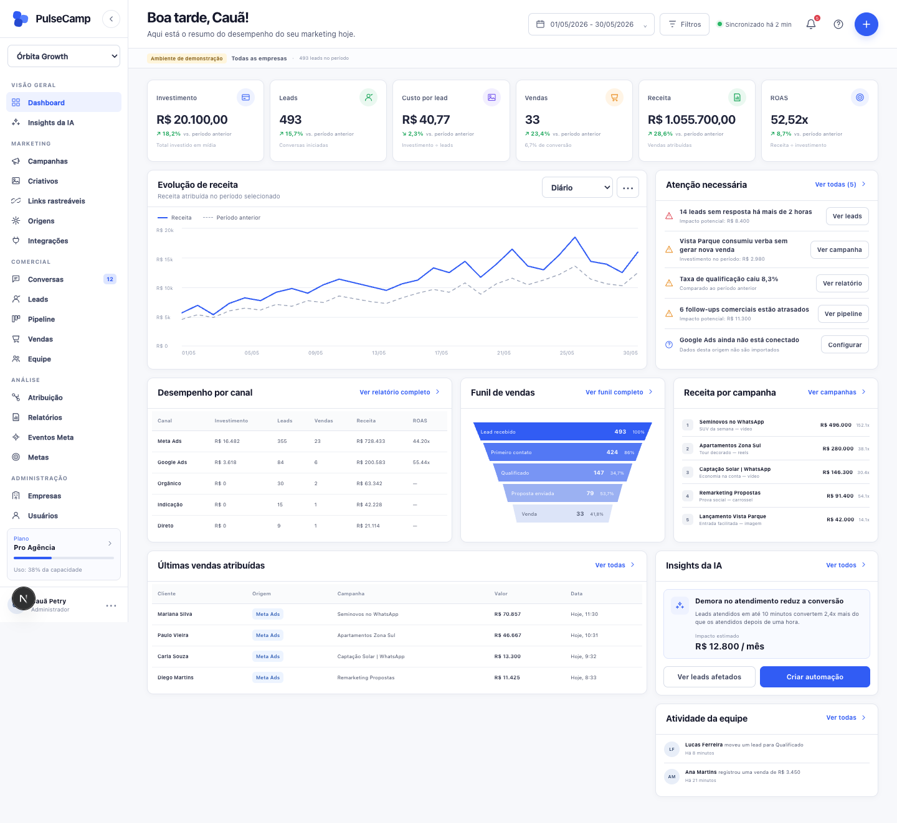
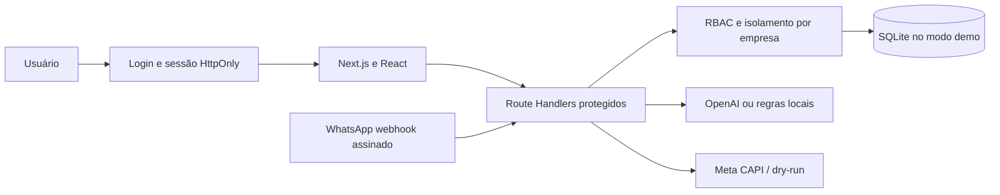
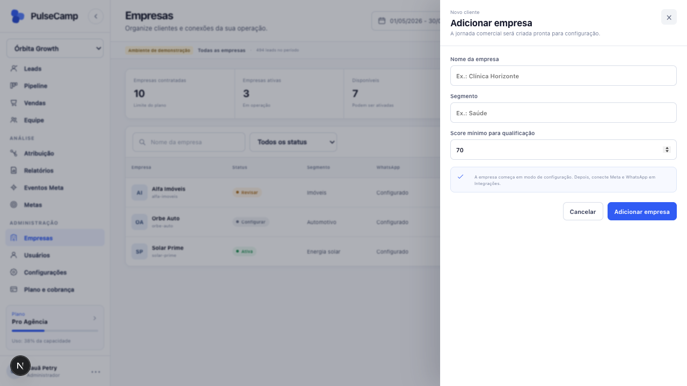
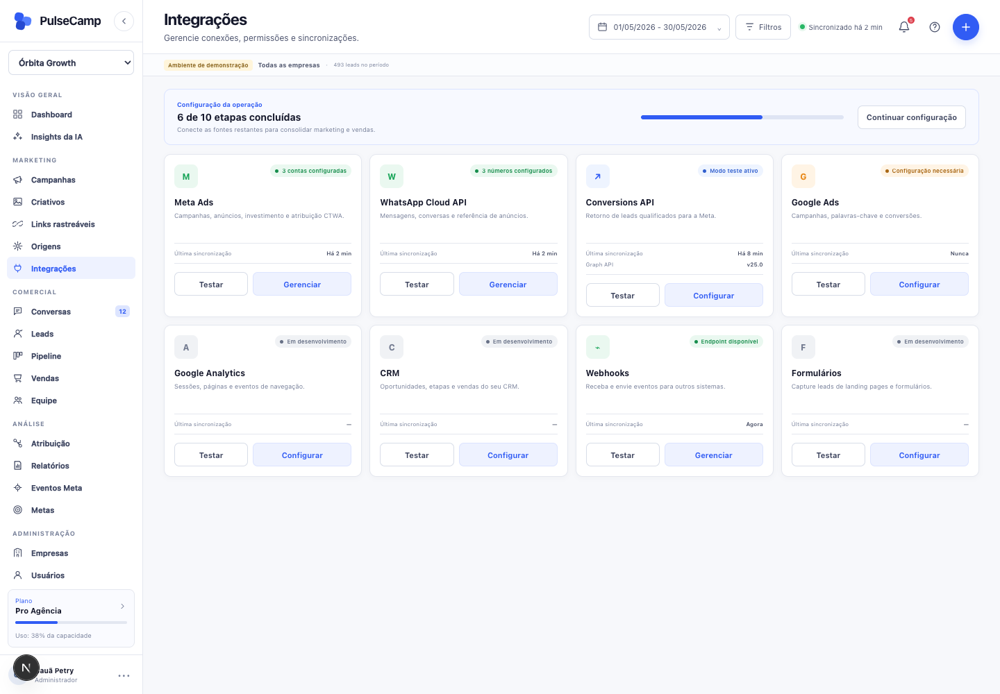

# PulseCamp AI

SaaS full stack para gestores de tráfego acompanharem campanhas Click-to-WhatsApp, qualificarem conversas e enviarem sinais de qualidade de volta para a Meta.

[Abrir demonstração](https://pulsecamp-ai-portfolio.vercel.app)



## O que o projeto demonstra

O PulseCamp conecta mídia paga, WhatsApp e operação comercial em um fluxo auditável. A aplicação captura a origem do clique, acompanha o lead, calcula um score, organiza o pipeline e registra eventos de conversão.

- Autenticação com sessão assinada em cookie `HttpOnly`.
- Papéis `admin` e `member`, com autorização aplicada no servidor.
- Isolamento de dados por empresa para perfis não administrativos.
- Proteção de origem nas mutações e limite de tentativas no login e na simulação.
- Dashboard multiempresa com investimento, leads, vendas, receita e ROAS.
- Captura de `ctwa_clid`, UTMs e `fbclid`.
- Qualificação estruturada com OpenAI e fallback determinístico.
- Pipeline configurável e registro de venda.
- Meta CAPI para `Contact`, `LeadSubmitted`, `Schedule`, `InitiateCheckout` e `Purchase`.
- Deduplicação, reprocessamento e auditoria de eventos.
- Tokens Meta criptografados com AES-256-GCM.
- Testes unitários, de integração e E2E com navegador real.

## Arquitetura



O diagrama detalhado e o modelo de dados estão em [docs/architecture.md](docs/architecture.md).

## Contas de demonstração

| Papel | E-mail | Senha | Escopo |
| --- | --- | --- | --- |
| Administrador | `admin@pulsecamp.demo` | `PulseCamp2026!` | Todas as empresas |
| Analista | `analista@pulsecamp.demo` | `Demo2026!` | Somente Solar Prime |

Essas credenciais são públicas e existem apenas para avaliação do produto. Em produção, `AUTH_USERS_JSON` deve conter hashes `scrypt` e `SESSION_SECRET` deve ser injetado pelo gerenciador de segredos.

## Stack

- Next.js 16, React 19 e TypeScript
- Zod
- OpenAI API
- WhatsApp Cloud API e Meta Conversions API
- SQLite no ambiente demonstrativo
- Playwright e Node.js Test Runner
- GitHub Actions

## Executar localmente

Requisitos: Node.js 24 ou superior.

```bash
npm ci
cp .env.example .env.local
npm run dev
```

Abra `http://localhost:3000/login`.

## Verificação

```bash
npm run typecheck
npm test
npm run test:e2e
npm run build
```

O fluxo E2E cobre login inválido e válido, criação de empresa, simulação de lead, movimentação no pipeline e registro de venda.

## Rotas principais

| Método | Rota | Proteção |
| --- | --- | --- |
| `POST` | `/api/auth/login` | Rate limit e cookie `HttpOnly` |
| `POST` | `/api/clients` | Admin |
| `POST` | `/api/demo/lead` | Sessão e acesso à empresa |
| `POST` | `/api/leads/:id/stage` | Sessão e acesso ao lead |
| `POST` | `/api/sales` | Sessão e acesso ao lead |
| `GET/POST` | `/api/webhooks/whatsapp` | Token de verificação e HMAC Meta |
| `POST` | `/api/meta/connections` | Admin e token criptografado |

## Decisões técnicas

- `META_CAPI_DRY_RUN=true` impede eventos reais na demonstração.
- Sem `OPENAI_API_KEY`, regras locais mantêm o fluxo reproduzível.
- Cookies usam `HttpOnly`, `SameSite=Lax` e `Secure` em produção.
- Erros inesperados são registrados de forma estruturada e retornam mensagens genéricas.
- O dashboard nunca recebe empresas fora do escopo do usuário.
- SQLite torna a avaliação local simples; PostgreSQL, reset de senha por e-mail e rate limit distribuído estão documentados como evolução de produção, sem serem apresentados como recursos já entregues.

## Screenshots

### Gestão de empresas



### Integrações e rastreamento



## Status

Demo técnica funcional, com fronteiras de autenticação e autorização implementadas. Consulte [SECURITY.md](SECURITY.md) antes de adaptar o projeto para uma operação real.

## Licença

Código publicado para avaliação de portfólio. Nenhuma licença de reutilização comercial é concedida neste momento.

---

Desenvolvido por [Cauã Petry](https://github.com/cauapetrytri-rgb).
