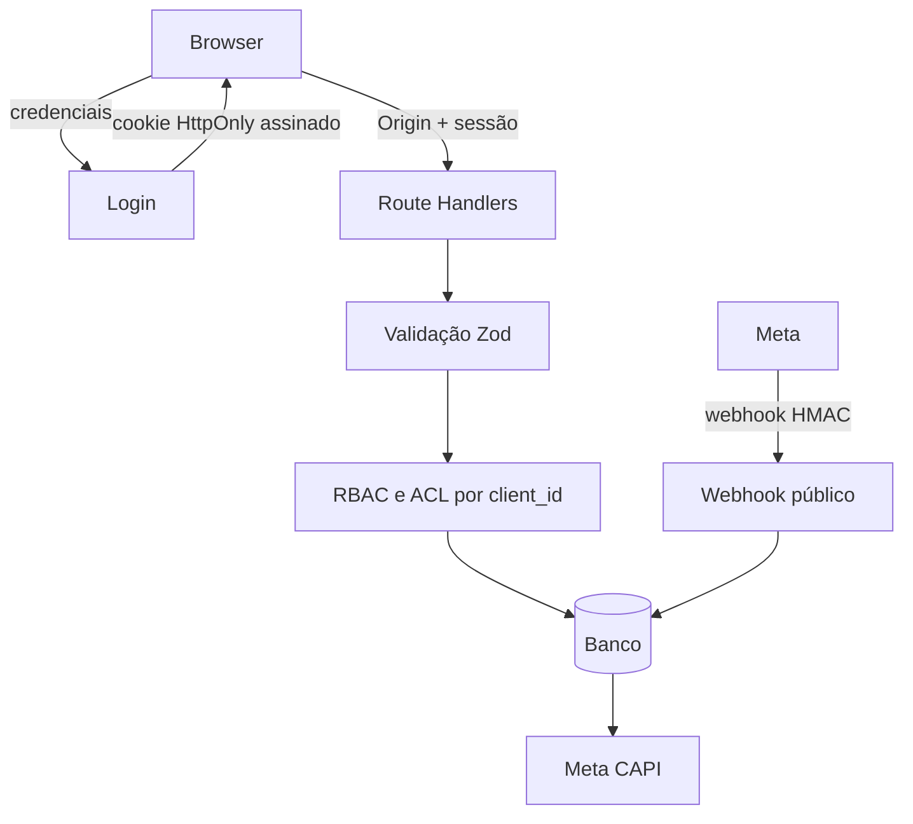
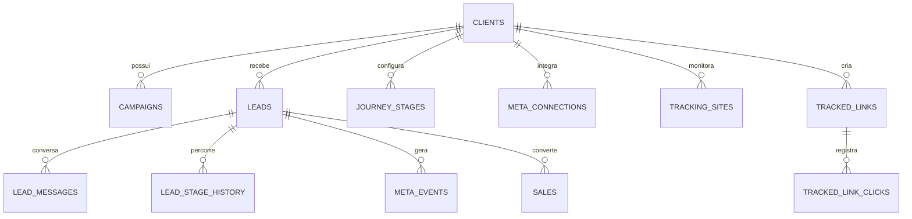

# Arquitetura e modelo de dados

## Limites de confiança

O webhook é público por necessidade de integração, mas valida token na assinatura inicial e `x-hub-signature-256` no recebimento. As rotas do painel exigem sessão e verificam a empresa antes de acessar o recurso.

## Entidades

Todas as entidades operacionais carregam `client_id`. A autorização resolve o `client_id` do recurso no servidor; valores enviados pelo cliente não são usados como única prova de acesso.

## Persistência

O modo demonstrativo usa `node:sqlite` e cria o schema de forma idempotente. Para produção multi-instância, a evolução prevista é PostgreSQL com migrations versionadas e pool compatível com serverless. Essa mudança exige provisionar o banco e não é simulada por um adapter incompleto.

## Observabilidade

Erros inesperados são registrados como JSON com nível, contexto, mensagem e horário. Cabeçalhos, cookies, tokens e corpos de autenticação não são registrados.
